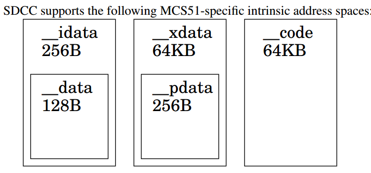

# SDCC编译器
> 只关注51相关内容
## 一、支持的数据类型
|type           |width               |default         |signed range                    |unsigned range|
|:---           |:----               |:----           |:----                           |:---          |
|_Bool / bool   |8 bits, 1 byte2     |unsigned        |- 0, 1
|char           |8 bits, |1 byte     |unsigned        |-128, +127                      |0, +255|
|short          |16 bits, 2 bytes    |signed          |-32.768, +32.767                |0, +65.535|
|int            |16 bits, 2 bytes    |signed          |-32.768, +32.767                |0, +65.535|
|long           |32 bits, 4 bytes    |signed          |-2.147.483.648, +2.147.483.647  |0, +4.294.967.295|
|long long      |64 bits, 8 bytes    |signed|
|float          |4 bytes, similar to IEEE 754 |signed |1.175494351E-38,3.402823466E+38| | |
|pointer        |1, 2, 3 or 4 bytes  |generic|

## 二、语言|扩展

1. __d|ata / __near  默认小内存模式，内部RAM空间地址
2. __xdata / __far  使用external RAM空间地址，默认使用大内存模式
3. __idata          间接访问地址空间，
4. __pdata          访问xdata的，默认使用中内存模式Medium Memory model
5. __code           变量将位于code memory
6. __bit            声明变量在位地址空间
7. __sfr / __sfr16 / __sfr32 / __sbit   描述特殊功能寄存器和特殊功能位变量
8. __at              绝对地址
9. 0b0110           二进制常量，使用编译选项 –std-sdccxx
10. return void     允许返回一个空类型，使用编译选项 –std-sdccxx
11. 参数和变量       默认参数和atuo变量是在栈上(idata),函数是不可重入的。如果要使用重入函数可使用关键字 __reentran 或使用 #pragma stackauto可重入，即不会访问函数外的空间，如静态变、全局变量的
12. overlaying      不可重入函数的参数和变量将在栈上被复写，#pragma nooverlay 确保不被复写
13. 中断服务        void timer_isr (void) __interrupt (1) __using (1) {}，中断服务程序可以放在任何文件中，但是isr必须放在main.c中， __using用于告知编译器使用那组寄存器。中断陷阱：a、变量不能声明为易失的，b、非原子操作，c、stack overflow， d、使用非重入函数
14. __critical     执行一个函数或代码段时关闭中断，型号锁
15. 内嵌汇编        a、__asm ... __endasm; b、 __asm__ (”inline_assembler_code”) 
16. 整型数操作支持   _mulint.c、_divsint.c等，提供的函数都是非重入的，不能直接在中断服务子程序中使用
17. 浮点数操作支持   _fsadd.c、 _fssub.c等，提供的函数都是非重入的，不能直接在中断服务子程序中使用
18. 库支持          stdio.h、malloc.h、math.h
19. 内存模型        Small, Medium, Large and Huge.
20. 编译指示        save/restore stack
## 三、