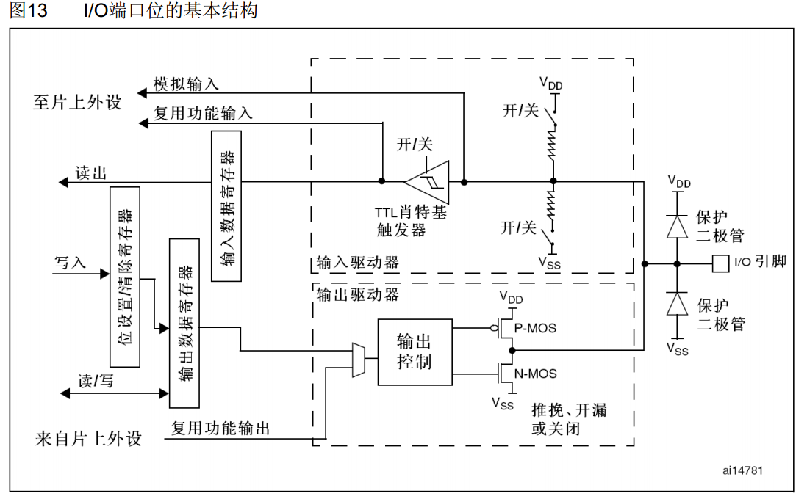
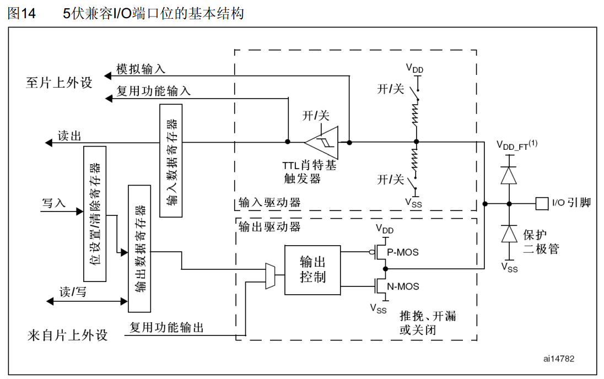
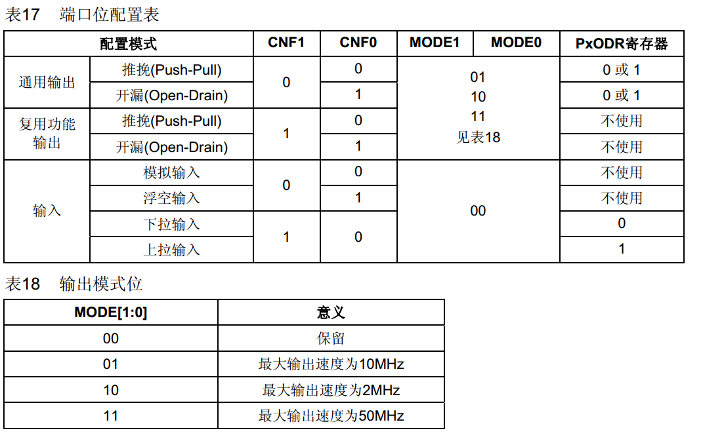

# 单片机IO控制

## IO口基本结构
stm32 IO口基本结构

80c51 IO口基本接口

## 一、IO的分类
（1）GPIO_Mode_AIN 模拟输入 

（2）GPIO_Mode_IN_FLOATING 浮空输入 

（3）GPIO_Mode_IPD 下拉输入 

（4）GPIO_Mode_IPU 上拉输入

（5）GPIO_Mode_Out_OD 开漏输出 
    开漏输出:输出端相当于三极管的集电极. 要得到高电平状态需要上拉电阻才行. 适合于做电流型的驱动,其吸收电流的能力相对强(一般20ma以内). 开漏形式的电路有以下几个特点： 
    1. 利用外部电路的驱动能力，减少IC内部的驱动。当IC内部MOSFET导通时，驱动电流是从外部的VCC流经R pull-up ，MOSFET到GND。IC内部仅需很下的栅极驱动电流。 
    2. 一般来说，开漏是用来连接不同电平的器件，匹配电平用的，因为开漏引脚不连接外部的上拉电阻时，只能输出低电平，如果需要同时具备输出高电平的功能，则需要接上拉电阻，很好的一个优点是通过改变上拉电源的电压，便可以改变传输电平。比如加上上拉电阻就可以提供TTL/CMOS电平输出等。（上拉电阻的阻值决定了逻辑电平转换的沿的速度 。阻值越大，速度越低功耗越小，所以负载电阻的选择要兼顾功耗和速度。） 
    3. OPEN-DRAIN提供了灵活的输出方式，但是也有其弱点，就是带来上升沿的延时。因为上升沿是通过外接上拉无源电阻对负载充电，所以当电阻选择小时延时就小，但功耗大；反之延时大功耗小。所以如果对延时有要求，则建议用下降沿输出。 
（6）GPIO_Mode_Out_PP 推挽输出 
    推挽输出:可以输出高,低电平,连接数字器件; 推挽结构一般是指两个三极管分别受两互补信号的控制,总是在一个三极管导通的时候另一个截止。高低电平由IC的电源低定。推挽电路是两个参数相同的三极管或MOSFET,以推挽方式存在于电路中,各负责正负半周的波形放大任务,电路工作时，两只对称的功率开关管每次只有一个导通，所以导通损耗小、效率高。输出既可以向负载灌电流，也可以从负载抽取电流。推拉式输出级既提高电路的负载能力，又提高开关速度。 详细理解： 

（7）GPIO_Mode_AF_OD 复用开漏输出 

（8）GPIO_Mode_AF_PP 复用推挽输出 