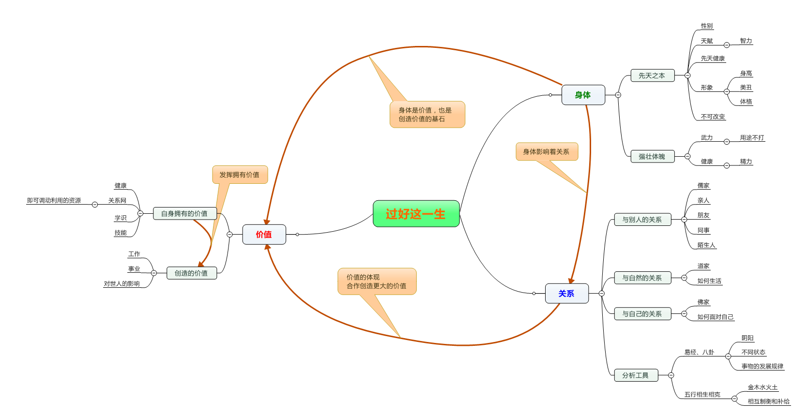

# 前言

> 水上清风

知道那么多道理，读过那么多书，却为何依旧过好这一生？
首先，道理光是知道是没用的，道理是用来懂的，用来指导行动的。
其次，读书也是没有用的，读书学来的知识和道理，都是要用的，光知道是没有任何意思的，产生不了任何价值。
最后，怎样的一生才算是好的一生？
我认为好的一生应该有三个方面相互关联而构成这一生。1、身体，2、关系，3、价值。这三者并不是独立的而是相互影响的。
说个偏颇的例子：一个孩子出生了，他身体的性别将决定了，他在这个家庭中的关系，如果是个男孩子，而这个家庭又重男轻女，那么这个男孩子将备受宠爱，而是个女孩子则可能不会那么被宠爱。这个孩子由于性别的差异从而导致他所在的关系的不同，这中家庭关系很大程度上将影响着，他以后的价值的拥有和产生。
因此要过好这一生，需要从身体、关系、价值这个三个方面着手，发挥自己的主观能动性，使自己这一生逐步向好的方向发展

