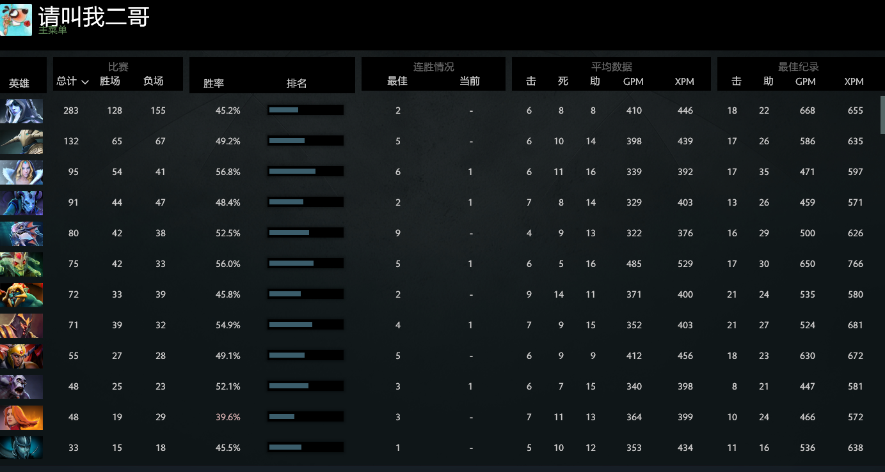

# Dota 所学

## 一、积极的态度、锲而不舍的精神最为重要

## 二、怪别人、埋怨别人最容易，但最没用，往往还使得结果变的更坏

## 三、队友很重要，互补才能让彼此都更好的发挥作用

## 四、临危不乱，才能瞅准机会，做出正确的判断

## 五、需要学习高手、不断练习精进

## 六、自我认识的好工具

1. 常用英雄代表着一种性格象征

以上这些英雄最大的特点：高爆发，输出高，都比较脆，单兵作战能力强，一马当先。
所以说我适合短期高速输出，比较急，持续性低，适合一鼓作气。不善于和人配合。有个人英雄主义倾向
需要在耐心、坚持、配合方面加强

2. 过程中的配合与交流
目前特点：一般不说话，有想法也不会，随大流。态度都较积极不消极对待，不用语言讥讽队友，多是鼓励。

改进：要试着带动团队，主动承担导向作用，主动正面交流

3. 英雄和战术的选择

目前特点：无大局观执着于某些固定套路。如执着于某个英雄，而不是根据局势选择。在各个阶段不知变通装备和策略。

